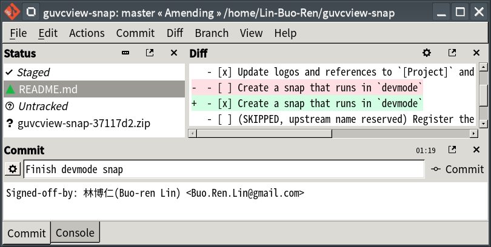

# Snap Packaging for Git Cola


**This is the snap for Git Cola**, *"The highly caffeinated Git GUI"*. It works on Ubuntu, Fedora, Debian, and other major Linux distributions.

[](https://build.snapcraft.io/user/Lin-Buo-Ren/git-cola-snap)




## Installation

```
# Install Git Cola
sudo snap install git-cola

# Connect the Snap to Optional Interfaces
## gpg-keys: For signing commits and tags
sudo snap connect git-cola:gpg-keys

## removable-media: For accessing Git repositories under `/media/*` and `/run/media/*`
sudo snap connect git-cola:removable-media

## ssh-keys: For remote operation via SSH protocol
sudo snap connect git-cola:ssh-keys

```

([Don't have snapd installed?](https://snapcraft.io/docs/core/install))

## The Difference between the Snapped and Traditional Distributed Git Cola
Due to snap's security confinement:

- The user's global Git configuration isn't accessible by the snapped Git Cola, you have to manually sync the configuration between $HOME/.gitconfig and the actual configuration file used by the snap($HOME/snap/git-cola/current/.gitconfig).
- You may only use the optional utilities(diff/merge tool, history browser, blame viewer...) shipped with the git-cola snap, external utilities in the host system are not available to Git Cola.  An exception is the editor, which will use the host's default application of the opening file.

## What is Working

- Launch
- I18N
- Launch help webpages
- Initialize new repository
- Clone existing repository
- Modify Git config
- Modify Git remotes
- File system change monitoring
- Launch host editor for editing files
- Stage changes
- Commit changes
- Remote fetch
- Remote push
- Create branch
- Rebase
- DAG view
- Stash
- File browser
- Visualize via gitk
- Compare differences between expressions/branches

## What is NOT Working...yet

- (None as of now)

## What is NOT Tested...yet

- send2trash
- grep
- Git Large File Storage
- Git Annex

And all the things not listed in the "What is Working" section

## Support

- [Issue Tracker](https://github.com/git-cola/git-cola/issues)  
  Please note that you're using the snap package, and which channel/version you're using.
- [The Snapcraft Forum](https://forum.snapcraft.io)
  
